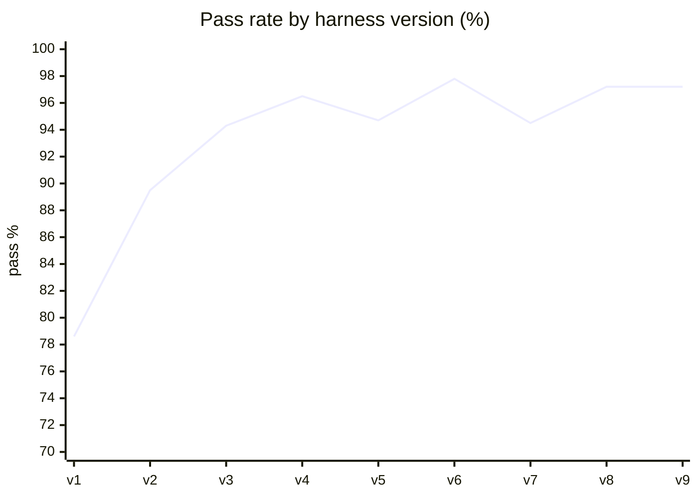

# Benchmark: does the v5 model work with a weak model?

The benchmark exists to improve the harness, not to pick a model. It runs the target model
(`qwen/qwen3.6-35b-a3b`, thinking off, via OpenRouter) through the real harness code on small,
isolated tasks for every role, and on a few whole pipelines. Where a result can be checked in
code it is; otherwise an LLM judge (`xiaomi/mimo-v2.6-pro`) checks written criteria.

Run it: `deno task bench [filter…] [--full] [--repeat N] [--label name]`. Without `--full` only
the hard cases run (`HARD` in `bench/run.ts`, about $0.007 per run; no episodes, see issue #27 below). Results land in
`bench/results/`, and every trace goes into `data/bench.db`. Open that in the observer UI with
`"db_path": "data/bench.db"` in `config.jsonc` and `deno task serve` → `http://localhost:8700/observer`
(the *calls* tab shows the bench case of each call).

## Result

**Final (v9): 318/327 case runs pass (97.2%)**, 109 cases × 3 repeats, about $0.10 per full run
including the judge. Baseline (v1): 81/103 (78.6%).

| group | what it tests | cases | v1 | v9 |
|---|---|---|---|---|
| segment | split a capture into items with verified quotes | 9 | 75% | 100% |
| route | pick the topic for an item (or `new`) | 10 | 100% | 100% |
| desk | intent → args → receipts, capture and conversation mode | 17 | 73% | 98% |
| triage | fits one session? missing info? | 9 | 67% | 96% |
| planner | pick_recipe, plan_fill, plan_generate | 7 | 57% | 86% |
| worker | research (offline corpus), write, synthesize sessions | 13 | 62% | 100% |
| verifier | one judge call per criterion | 9 | 100% | 100% |
| librarian | answered / narrow / proceed from memory | 5 | 100% | 100% |
| memory | subject match, relevance rubric, merge decisions, owner facts | 12 | 91% | 94% |
| answers | answer matching (code first), briefing, topic_same | 9 | 100% | 100% |
| episode | whole pipelines = milestone acceptance tests | 9 | 43% | 93% |

v5 is a reverted experiment; v7 added harder cases taken from a live trace (see below).
Run-to-run noise at 3 repeats is about ±2 points, so v6, v8 and v9 are equal.
v1→v2 also includes bench fixture fixes (owner profile, corpus domains), not only harness changes.

## How the bench is built

- **Isolation.** Every case runs against a fresh in-memory SQLite database, with a fixed clock
  (Tue 29 Sep 2026, 08:14 Zurich), the offline corpus instead of the web, and an owner profile
  ("Alex lives in Zurich", "prefers low-maintenance options"). Cases run concurrently.
- **Real code paths.** Cases call the same functions production uses (`segment`, `routeItem`,
  `deskTurn`, `triageDecide`, `runWorker`, `runLibrarian`, `consolidateOne`, `processCapture`,
  `runTree` …), so harness changes (code rules, wording, gating) show up in the score. Only
  the planner and verifier cases call their prompt directly.
- **Mechanical checks first.** Receipts (what the harness did), card states, due dates, item
  counts, quote matches, tool calls, model-call counts. The judge is used for text quality and
  honesty: "does not invent a figure", "does not claim an action that isn't in the receipts".
- **Episodes = acceptance tests.** `capture-three-items` (M3.1), `undo-new-card` (M3.4),
  `move-item-reparents` (M3.7), `write-card` (M1.2), `recipe-tree` (M2.1), `memory-reuse` (M4.1),
  plus `research-card`, `compare-card` and `capture-no-cross-talk`.
- **Corpus.** `bench/corpus/*.md`: fictional shop, library, zoo, tax and product pages. One long
  page puts the key fact past the first 2500-character window, to test paging. A `keywords:` line
  stands in for a real engine's multilingual matching and is never shown to the model.

## What the benchmark changed in the harness

Each row was found in a trace, fixed, and confirmed by the next run.

| # | Failure seen | Cause | Change | Principle |
|---|---|---|---|---|
| 1 | Mixed one-sentence captures filed as one item | Design rule: segment only if >1 sentence or >30 words | Segment above 12 words | — |
| 2 | Desk created the same card 3× | Used intents were offered again; result text "Is there anything else…?" invited a repeat | Don't re-offer a used intent; result text "That part is handled; don't do it again. If nothing else is left, choose done." | P4, P13 |
| 3 | Desk folded a reminder into a research card | Args call saw the whole input | "Only for the part that asks for research or writing" | P2 |
| 4 | Desk said it cancelled a card it can't cancel | No cancel intent | `cancel_card` intent with undo (re-creates the card) | P4 |
| 5 | Worker asked "which city?", blocked for permission to read page 2 | No owner profile; `block` too loosely described | Profile in context; block "ONLY when the owner must decide"; "make a sensible assumption and say so" | P4 |
| 6 | Worker never paged a long page | Continue-hint only in the header | Also a footer: "The text continues. Read the rest with read_artifact(…)" | P13 |
| 7 | "Not found" ended as `fail`, result lost | `fail(impossible)` treated as failure | For research, not-found becomes a result; the verifier decides | P1 |
| 8 | Triage asked "which 4 insurers?" | Weak `missing_info` wording | "null unless only the owner can know it; if the work can choose, find or assume it, null" | — |
| 9 | Triage flips on "compare 3 kits" | Model judgement (DESIGN §19 Q1) | Triage outputs `compare_count`; code forces a split at ≥3 | P1 |
| 10 | plan_fill copied the whole request into `criteria` → child goals like "Find Compare the Gardena…" | — | Param example + code guard (retry, then fallback) | P1 |
| 11 | Recipe gather aimed for exactly 5 items, then blocked | "up to {max_items}" read as a quota; default 5 | Default 3; "the best ones you find, fewer is fine"; verifier rejects an items step with no items | P12 |
| 12 | Price facts stored as `slow` | Model ignores volatility help | Code: a claim with a money amount is `volatile` | P12 |
| 13 | Consolidator superseded a price with an unrelated battery fact → memory lost the price → librarian couldn't answer | `update`/`contradicts` on a different detail | Code guard: same detail = similar wording or both prices; else `new` | P1 |
| 14 | match_subject: "Gardena drip starter kit" ≠ "Gardena Micro-Drip starter set" | Model checked whether the note already *contains* the fact | "The note only needs to be about the same thing" + 3 examples | §10.4.4 |
| 15 | Desk acted on other items of the same memo (e-bike card in the garden topic, "Friday" borrowed from the tax item) | Design gives the desk the full transcript | Desk sees only its item | see DEVIATIONS |
| 16 | After answering a question the desk also added to a card and set a reminder | Later passes offered actions directly | Gate: `desk_more` asks "is a separate request left? yes/no" before any further action | P2 |
| 17 | Verifier passed "I wrote the email and saved it" with no file | Trusted the result over the record | "If the result claims something the system did not record, it did not happen" | P12 |
| 18 | 6 worker parse errors (all recovered by retry) | Provider Darkbloom doesn't enforce `anyOf`/`const`; model writes `"action": "web_fetch"` | Quirk repair: tool name as action → tool action (logged as a repair) | §10.2 |
| 19 | "Research X and message me about it" and "There was X. Research why." split into two topics (issue #19) | "Don't combine two subjects" read as "split at every request or sentence" | `segment_capture/v3`: "split only where each part would still be clear on its own", plus a three-line list of what stays together (background + request, follow-up on another part's result, back-references like "it", "why") | P2 |
| 20 | "yes, request the paid extension" answered the question, then also added to the card or created a card (issue #24) | `desk_more` v1 asked "is a request still NOT handled? yes/no"; the negation flipped the answer: in 16 of 30 traces the analysis said nothing was left and the answer was `yes` | `desk_more/v2`: options `nothing` / `another_request`, and the words of an answer to a question count as handled | P2 |

**A negative result (v5).** Splitting triage's `missing_info` into its own gated call
("Can work start without asking the owner?") made it *worse*: triage dropped from 96% to 85%
because a question that is only about missing information primes the model to find some
("Which library in Zurich?"). Reverted. Gating helped where the gate is "is anything left to do?"
(row 16), and hurt where the gate is "is anything missing?".

**From a live trace.** Rows 1 and 15 were found by running the server on a real capture, not by
the bench. Both became bench cases (`segment/one-subject-two-questions`,
`episode/capture-no-cross-talk`, `desk/remark-without-cards`), which is DESIGN §14.3's
"grow cases from traces" in practice.

## Is the target model capable enough?

Yes, for every role, once the harness does its part. The 9 episode types (capture → 3 topics →
3 actions; research with paging; write with intact newlines; recipe tree gather → fan-out →
synthesis; memory reuse with zero worker steps; undo; move) passed 27/27 in v8 and 25/27 in v9.

Calls stay small (final run, target model only):

| call type | calls | avg tokens in | avg tokens out | avg ms |
|---|---|---|---|---|
| worker_step | 262 | 869 | 121 | 1419 |
| desk_intent | 91 | 311 | 43 | 981 |
| verify_criterion | 81 | 307 | 55 | 1160 |
| desk_more | 70 | 183 | 43 | 1038 |
| route_item | 57 | 278 | 61 | 1319 |
| triage | 40 | 424 | 86 | 1312 |
| segment_capture | 33 | 299 | 103 | 1533 |
| desk_args_new_work | 33 | 350 | 153 | 1814 |
| plan_generate | 3 | 351 | 378 | 4825 |

The local validator repaired 29 of 900 outputs, mostly `analysis` strings over their length limit
(the engine ignores `maxLength`, as `sandman probe` reports). No call failed for good.

## Remaining failures (v9) and what they mean

- **planner/generate-trip (0/3).** Free-mode plans for a trip always contain dependent subtasks
  ("hotels in the cities from subtask 1"). Prompt changes didn't fix it across four versions.
  This is structural: free mode can't express sequences. A sequential recipe (route → then
  hotels and trains per stop) is the fix the design already points to (§5.6).
- **memory/relevance-trivial (1/3).** Rubric v2 keeps product specs (good) but now also keeps
  "Bern is the capital of Switzerland". A cheap trade; a code stoplist could cover it.
- **triage/write-missing-info (2/3).** "Write a letter to my insurance about my claim" sometimes
  starts without asking. Borderline.
- **desk/answer-one-of-two, episode/compare-card, episode/memory-reuse (2/3 each).** Occasional
  extra `add_to_card` after an answer; one detail card blocking with a design-conformant question
  (the tree correctly waits); the librarian narrowing instead of answering from a fresh note.

## Open design questions the bench answered (DESIGN §19)

1. **Compare rule** — adopted as a code rule on a counted field (row 9).
2. **Desk structure** — kept intent → args, and added a yes/no gate for later passes (row 16).
   The single-tool-loop alternative was not benchmarked.
9. **Follow-up captures / full-memo context** — giving the desk the whole memo causes cross-talk;
   each item is now handled alone (row 15).

## Chat-first client (after v9)

The chat-first client (docs/DEVIATIONS.md) added 12 cases: 6 routing cases for the new `chat`
option ("hi", "brief me in one sentence", "give me an overview", and topic questions that must
*not* go to chat), 5 desk cases in a conversation topic (greeting, overview covering every open
topic, "in one sentence", new work filed into a subject topic, answering another topic's question)
and one episode ("hi, what's new?" from home). Result over 3 repeats: **357/363 (98.3%)**; routing
48/48, desk 64/66, episodes 30/30, no regressions elsewhere.

One fix came from a live run, not the bench: "hi" in a conversation topic got no answer, because the
desk chose `nothing`. `nothing` is no longer offered in conversation topics (`desk/conversation-hi`).

## Over-splitting (issue #19)

Captures whose second part needs the first were split into separate topics: "Research when the
Umwelt Arena Spreitenbach was created and message me about it tomorrow morning", and background
followed by "Research why". Five cases (`segment/research-then-message-about-it`,
`background-then-request`, `find-then-book-it`, `context-then-question`, and
`dependent-plus-unrelated`, which must still split off an unrelated reminder) failed 9 of 15 runs
on `segment_capture/v2`; with the old prompt the background sentence was sometimes dropped entirely.
v3 (row 19) passes all 14 segment cases × 5 twice (70/70, 70/70; v2: 32/42 over 3 repeats).
What carries it is the three-line list of what stays together; two extra worked examples added
nothing, and a one-sentence version of the list ("background, a follow-up on its result, 'it',
'there', 'why'") dropped to 94–97%. Route, desk and the
capture episodes showed no failures traceable to the change. `desk/conversation-answers-question`
(no segmenter call) fails now and then on both prompt versions.

## Extra actions after an answer (issue #24)

`desk/conversation-answers-question` ("yes, request the paid extension" against an open question
"Should I request the paid extension to November?") failed 7 of 40 runs on master: after the
correct `answered` receipt the desk also added to the tax card or created a card. The traces
showed the cause in `desk_more`, not in the answer: the gate asked "is a separate request still
NOT handled? yes/no", and the model answered the un-negated question. In 16 of 30 traced runs its
analysis said "no separate or pending requests" and then `left: yes`; the second `desk_intent`
pass then acted on the answer text. All 30 first `desk_more` calls went to one provider (AkashML),
and it answered both ways, so the flip is the prompt, not a provider.

`desk_more/v2` (row 20) names its options (`nothing` / `another_request`) and says that the words of
an answer count as handled. Result: the case 40/40 (master 33/40); desk + episode groups × 3:
96/96 (master 94/96, one of the two failures the same bug in
`desk/conversation-work-goes-to-topic`), with 204 desk calls instead of 215. The case is in
`HARD` now.

## Episodes split into stage cases (issue #27)

A hard run cost about $0.011, and the four episodes in `HARD` were $0.008 of it (213 of 313 target
calls over 3 repeats). Episodes are now `--full` only; `HARD` holds the stage each one failed at, as a
unit case built from the episode's own trace (goals, quotes and facts copied from real runs):

| episode | how it failed (saved runs) | stage case in `HARD` |
|---|---|---|
| recipe-tree | 7/31: the gather worker blocked ("which third candidate: AquaLine or Claber?") | `worker/research-gather-open` |
| compare-card | 3/31: tree stuck in waiting/blocked | `worker/research-gather-open`, `triage/compare-three-named` |
| memory-reuse | 4/32: the second card went to a worker although the note existed | `librarian/answered-rephrased` |
| capture-no-cross-talk | 3/18: "what a service costs" split off as a fourth item | `segment/no-cross-talk-memo` |
| capture-three-items | 3/32: the garden item also created a card | `desk/episode-balcony-add` |

`worker/research-not-available-honest` (the detail step on a missing spec) joined `HARD` too: with 6 failures in 41 saved runs it
fails more often than any other unit case. Other new stage cases are `--full` only: `route/episode-*`,
`worker/research-gather-named`, `librarian/detail-from-gather-facts` (a detail card answered from the
gather step's pending facts, which is how the tree fills in details) and
`memory/consolidate-research-result`.

Measured today: the old hard set $0.0338 for 3 repeats, the new one $0.0223 and $0.0226 in two runs, so **$0.0074 per hard run**
including the judge (target calls 313 → 165). The episodes themselves passed 49/50 (5 repeats); the one
failure was the gather block, which the unit case did not reproduce in 30 runs, so it is rare now. The
stage cases passed 349/350 (10 repeats).

What the stage cases don't cover, and why episodes stay in `--full`: the composition (fan-out, tree
waiting on children, the confirmation text, move and undo). Those parts are code, not model calls.

## Cost

The whole session, including smoke tests and 10 benchmark runs, used about $0.80 of OpenRouter
credit. A full 3-repeat run costs about $0.10.
